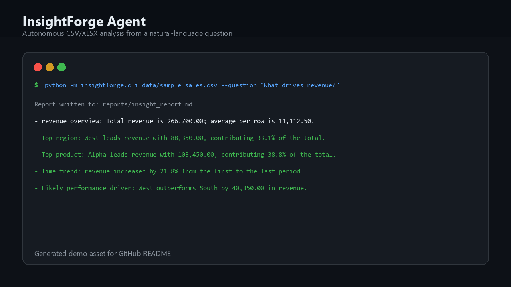
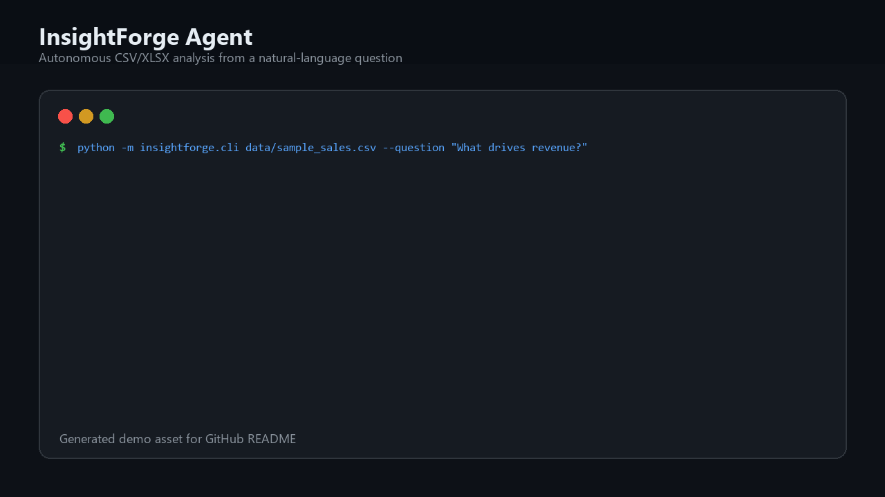

# InsightForge: Autonomous Data Analyst Agent

[](https://github.com/Nasir-ux1/insightforge-agent/actions/workflows/ci.yml)
[](https://github.com/Nasir-ux1/insightforge-agent/releases/tag/v0.1.0)
[](pyproject.toml)

InsightForge is a portfolio-ready AI/ML agent project that turns a raw CSV/XLSX dataset and a natural-language business question into a structured analysis report.

The project demonstrates agent-style decomposition: dataset profiling, cleaning, analysis planning, insight generation, visualization, and report writing.

## Demo





## Features

- Upload or pass a CSV/XLSX dataset
- Automatic data profiling: rows, columns, missing values, duplicates, numeric/categorical/date fields
- Data cleaning: normalized columns, duplicate removal, missing value handling, date inference
- Natural-language question planning
- Automated metric and dimension selection
- Trend analysis over time
- Segment/driver analysis
- Chart generation with matplotlib
- Markdown executive report export
- CLI and Streamlit app entry points
- Unit tests for planner, cleaner, and end-to-end agent flow

## Architecture

```text
User Question + Dataset
        |
        v
Dataset Profiler -> Data Cleaner -> Analysis Planner
        |                              |
        v                              v
 Insight Generator -> Chart Builder -> Report Writer
        |
        v
 Markdown Report + PNG Charts + Follow-up Ready Insights
```

## Tech Stack

- Python
- pandas / numpy
- matplotlib
- Streamlit
- pytest

Optional extension points:

- OpenAI/Claude/Gemini for narrative generation
- FAISS/ChromaDB for RAG over uploaded reports
- FastAPI for API deployment
- Docker for reproducible execution

## Quick Start

```bash
python -m venv .venv
.venv\Scripts\activate
pip install -r requirements.txt
```

Run the CLI:

```bash
python -m insightforge.cli data/sample_sales.csv --question "What are the main drivers of revenue performance over time?"
```

Run the Streamlit UI:

```bash
streamlit run app.py
```

Run tests:

```bash
pytest
```

## Example Output

For the included sample sales dataset, InsightForge produces:

- Dataset profile
- Revenue overview
- Top-performing region/product/channel
- Monthly revenue trend
- Driver insight
- Markdown report in `reports/insight_report.md`
- PNG charts in `reports/`
